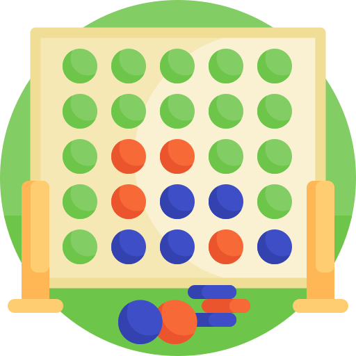

<p align="center">
  <a href="" rel="noopener">
 </a>
</p>

<h3 align="center">Connect Four Game</h3>

<div align="center">

[]()
[](https://github.com/MuammerBayar/readmeTemplate/issues)
[](https://github.com/MuammerBayar/readmeTemplate/pulls)
[](/LICENSE)

</div>

---

<p align="center"> This project was made for the file organization course.
    <br> 
</p>

## 📝 Table of Contents
- [🧐 About](#about)
- [🏁 Getting Started](#getting_started)
- [️️⛏️ Built Using](#built_using)
- [🚀 Future Scope](#future)
- [🤝 Contributing](#contributing)
- [📝 License](#license)

<!-- ABOUT -->

## 🧐 About <a name = "about"></a>
This project includes a Connect Four game developed using the Java programming language. The game is presented as a desktop application with a simple interface. Connect Four is a strategy game where two players take turns trying to achieve their goals.

The object of the game is to line up the four game pieces horizontally, vertically or diagonally, thus completing a line. Players take turns placing their pieces at the top of the game board, and the pieces are placed upwards, starting from the bottom rows. The player who puts the first four pieces together wins the game.

The Connect Four game was developed using the Java programming language as a desktop application. The use of Java has enabled the game to be presented with a user-friendly interface. The interface allows players to see the game board, place their pieces and follow the game status.

The game makes the necessary checks to determine when players place their pieces, a winner or a tie. If a player aligns the four pieces correctly and forms a line, they win the game. Otherwise, the game ends in a draw.

The Connect Four game is platform independent as it was developed using the Java programming language. Therefore, it can run on different operating systems such as Windows, Mac or Linux.

The project can be a great example to improve your skills in Java programming language and desktop application development.

<p align="right"> <a href="#top"><b>🔝 Return </b></a> </p>


<!-- GETTING STARTED -->

## 🏁 Getting Started <a name = "getting_started"></a>
These instructions will get you a copy of the project up and running on your local machine for development and testing purposes. See [deployment](#deployment) for notes on how to deploy the project on a live system.

### Prerequisites
What things you need to install the software and how to install them.

Installıng Java 
```
$ sudo apt install default-jdk
```

### Installing
A step by step series of examples that tell you how to get a development env running.

Cloning the repo
```
$ git clone https://github.com/MuammerBayar/Connect4Game
```

Go to the directory where the jar file is located
<p> note: please complete the beginning of the path correctly </p>

```
$ cd  /connect4game/ConnectFour 
```

Running the Jar file

```
$ java -jar ConnectFour-6.0.0.jar
```

The application will now be running.

<p align="right"> <a href="#top"><b>🔝 Return </b></a> </p>


<!-- BUILT USING -->

## ⛏️ Built Using <a name = "built_using"></a>
- [Java](https://www.java.com/) - All Modules

<p align="right"> <a href="#top"><b>🔝 Return </b></a> </p>


<!-- FUTURE UPDATE -->

## 🚀 Future Update <a name = "future"></a>
- Updating codes with some frameworks
- Using Database

<p align="right"> <a href="#top"><b>🔝 Return </b></a> </p>


<!-- CONTRIBUTING -->

## 🤝 Contributing  <a name = "contributing"></a>

Contributions are what make the open source community such an amazing place to learn, inspire, and create. Any contributions you make are **greatly appreciated**.

If you have a suggestion that would make this better, please fork the repo and create a pull request. You can also simply open an issue with the tag "enhancement".
Don't forget to give the project a star! Thanks again!

1. Fork the Project
2. Create your Feature Branch (`git checkout -b feature/AmazingFeature`)
3. Commit your Changes (`git commit -m 'Add some AmazingFeature'`)
4. Push to the Branch (`git push origin feature/AmazingFeature`)
5. Open a Pull Request

<p align="right"> <a href="#top"><b>🔝 Return </b></a> </p>


<!-- LICENSE -->

## 📝 License <a name="license"></a>

This project is [MIT](./LICENSE) licensed.

_NOTE: we recommend using the [MIT license](https://choosealicense.com/licenses/mit/) - you can set it up quickly by [using templates available on GitHub](https://docs.github.com/en/communities/setting-up-your-project-for-healthy-contributions/adding-a-license-to-a-repository). You can also use [any other license](https://choosealicense.com/licenses/) if you wish._

<p align="right"> <a href="#top"><b>🔝 Return </b></a> </p>
